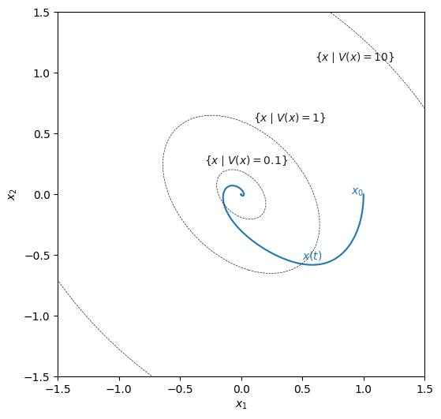

# Bilinear SOS Problem

This example demonstrates how to find a polynomial Lyapunov function $V(x)$ that certifies the stability of a nonlinear control system of the form:

$$
\dot x = f(x) + G(x) u(x) = \begin{bmatrix}x_2 + x_1^2 - x_1^3 \\ 0\end{bmatrix} + \begin{bmatrix}0 \\ 1\end{bmatrix} u(x),
$$
where $u(x)$ is a polynomial controller. The goal is to find a scalar, positive definite polynomial $V(x)$ such that:

$$V(x) > 0 \quad \text{for } x \neq 0, \quad V(0) = 0$$

$$
\dot V(x) = \nabla V(x)^\top \left ( f(x) + G(x) u(x) \right ) < 0 \quad \text{for } x \neq 0.
$$


This condition is bilinear in the coefficients of $V(x)$ and $u(x)$, and therefore cannot be directly formulated as an SOS Problem.
To address this, we fix the coefficients of $u(x)$ using an initial guess, converting the problem into a linear SOS problem that can be solved efficiently.

To ensure feasibility, we restrict the analysis to an operating region defined by a ball of radius $r$:

$$\mathcal X_\text{op} = \{ x \mid x^\top x <= r^2 \}.$$


<!-- Given the Square Matricial Representation (SMR)

$$
V(x) = Z(x)^\top Q_V Z(x),
$$

the SOS problem encoding these condition is selected as:

$$
\begin{array}{ll}
    \text{find} & Q_V \\
    \text{minimize} & \text{tr}( Q_V ) \\
    \text{subject to} & \nabla V(x)^\top \left ( f(x) + G(x) u(x) \right ) + 0.1 x^\top x \leq 0 \quad \forall x \\
    & V(x) - 0.1 x^\top x \geq 0 \quad \forall x.
\end{array}
$$ -->


``` python
--8<-- "examples/bilinearproblem.py"
```

This figure illustrates the contour of the resulting polynomial $V(x)$:

