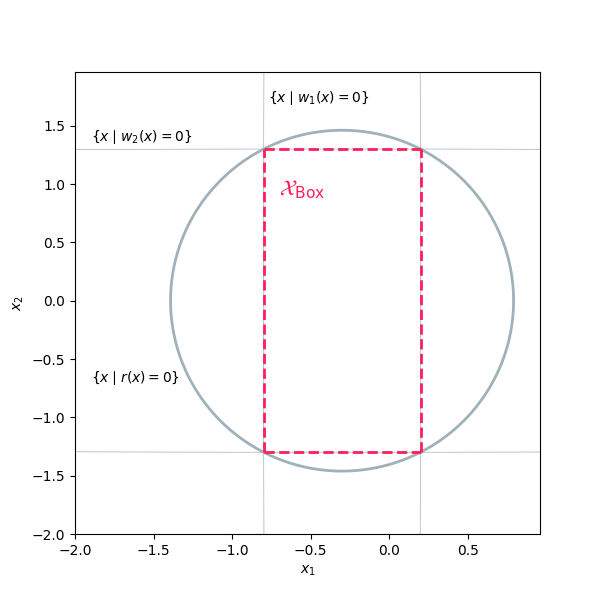

# Box Constraint

This example illustrates how to define and solve a simple SOS optimization problem using **SOSOpt**.

In this example, we aim to compute the coefficients of a polynomial $r(x)$ whose zero-sublevel set contains the box-like set defined by the intersection of the zero-sublevel sets of polynomials $w_1(x)$ and $w_2(x)$:

$$\mathcal X_\text{Box} := \lbrace x \mid w_1(x) \leq 0, w_2(x) \leq 0 \rbrace$$

The polynomial $r(x)$ is parameterized by the symmetric matrix $Q_r$, and is expressed as:

$$r(x) := Z(x)^\top Q_r Z(x)$$

where $Z(x)$ is a vector of monomials in $x$.

The SOS optimization problem is formulated to find $r(x)$ that maximizes the surrogate for the volume of the zero-sublevel set of $r(x)$, represented by the trace of $Q_r$. 
The resulting SOS problem is defined as:

$$\begin{array}{ll}
    \text{find} & Q_r \in \mathbb R^{m \times m} \\
    \text{minimize} & \text{tr}( Q_r ) + \text{diag}( Q_r )^\top \text{diag}( Q_r ) \\
    \text{subject to} & r(x) < 0 \quad \forall x \in \mathcal X_\text{Box} \\
\end{array}$$

This formulation seeks to minimize the trace of $Q_r$ while ensuring that $r(x)$ is negative within the box-like set $\mathcal X_\text{Box}$.

``` python
import polymat
import sosopt

# Initialize the state object, which is passed through all operations related to solving
# the SOS problem
state = sosopt.init_state()

# Define polynomial variables and stack them into a vector
variable_names = ("x_1", "x_2", "x_3")
x1, x2, x3 = tuple(polymat.define_variable(name) for name in variable_names)
x = polymat.v_stack((x1, x2, x3))

# Define the box-like set as the intersection of the zero-sublevel sets of two
# polynomials w1 and w2.
w1 = ((x1 + 0.3) / 0.5) ** 2 + (x2 / 20) ** 2 + (x3 / 20) ** 2 - 1
w2 = ((x1 + 0.3) / 20) ** 2 + (x2 / 1.3) ** 2 + (x3 / 1.3) ** 2 - 1

# Define a polynomial where the coefficients are decision variables in the SOS problem
r_var = sosopt.define_polynomial(
    name='r',
    monomials=x.combinations(degrees=(1, 2)),
)
# Fix the constant part of the polynomial to -1 to ensure numerical stability
r = r_var - 1

# Prints the symbol representation of the polynomial:
# r(x) = r_0*x_1 + r_1*x_2 + ... + r_8*x_3**2 - 1
state, sympy_repr = polymat.to_sympy(r).apply(state)
print(f'r={sympy_repr}')

# Apply Putinar's Positivstellensatz to ensure the box-like set, encoded by w1 and w2, 
# is contained within the zero sublevel set of r(x).
state, constraint = sosopt.quadratic_module_constraint(
    name="rpos",
    smaller_than_zero=r,
    domain=sosopt.set_(
        smaller_than_zero={
            "w1": w1,
            "w2": w2,
        },
    ),
).apply(state)

# Minimize the volume surrogate of the zero-sublevel set of r(x)
Qr_diag = sosopt.gram_matrix(r, x).diag()

# Define the SOS problem
problem = sosopt.sos_problem(
    lin_cost=-Qr_diag.sum(),
    quad_cost=Qr_diag,
    constraints=(constraint,),
    solver=sosopt.cvxopt_solver,   # choose solver
    # solver=sosopt.mosek_solver,
)

# Solve the SOS problem
state, sos_result = problem.solve().apply(state)

# Output the result
# Prints the mapping of symbols to their correspoindg vlaues found by the solver
print(f'{sos_result.symbol_values=}')

# Display solver data such as status, iterations, and final cost.
print(f'{sos_result.solver_data.status}')      # Expected output: 'optimal'
print(f'{sos_result.solver_data.iterations}')  # Expected output: 6
print(f'{sos_result.solver_data.cost}')        # Expected output: -1.2523582776230828
print(f'{sos_result.solver_data.solution}')    # Expected output: array([ 5.44293046e-01, ...])
```

This figure illustrates the contour of the zero-sublevel sets of the resulting polynomial $r(x)$:

