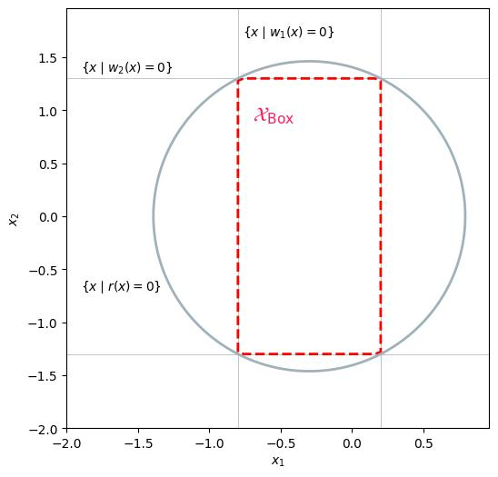

# Envelope for Box Constraints

This example illustrates how to define and solve a simple SOS optimization problem using **SOSOpt**.

In this example, we aim to compute the coefficients of a polynomial $r(x)$ whose zero-sublevel set contains the box-like set defined by the intersection of the zero-sublevel sets of polynomials $w_1(x)$ and $w_2(x)$:

$$\mathcal X_\text{Box} := \lbrace x \mid w_1(x) \leq 0, w_2(x) \leq 0 \rbrace.$$

The polynomial $r(x)$ is parameterized by the symmetric matrix $Q_r$, and is expressed as:

$$r(x) := Z(x)^\top Q_r Z(x),$$

where $Z(x)$ is a vector of monomials in $x$.

The SOS optimization problem is formulated to find $r(x)$ that maximizes the surrogate for the volume of the zero-sublevel set of $r(x)$, represented by the trace of $Q_r$. 
The resulting SOS problem is defined as:

$$\begin{array}{ll}
    \text{find} & Q_r \in \mathbb R^{m \times m} \\
    \text{minimize} & \text{tr}( Q_r ) + \text{diag}( Q_r )^\top \text{diag}( Q_r ) \\
    \text{subject to} & r(x) < 0 \quad \forall x \in \mathcal X_\text{Box}. \\
\end{array}$$

This formulation seeks to minimize the trace of $Q_r$ while ensuring that $r(x)$ is negative within the box-like set $\mathcal X_\text{Box}$.

``` python
--8<-- "examples/boxconstraints.py"
```

This figure illustrates the contour of the zero-sublevel sets of the resulting polynomial $r(x)$:


